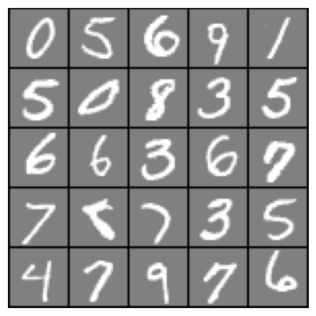
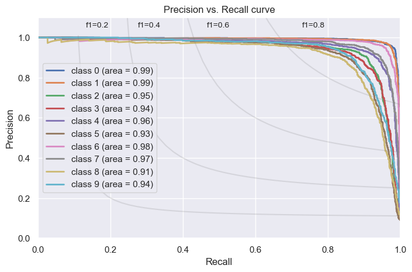

## Hand-Written-Images-Classifier
This repository contains a jupyter notebook implementation of classification models (two at the moment: _logistic regression_ (using sklearn) and _neural network_ (using Keras)). 
The models were trained to predict numbers in images containing hand-written numbers, based on the publicly available [MNIST dataset](http://yann.lecun.com/exdb/mnist/). 
Models are then evaluated for their performance and compared. 

View the latest version including results [HERE](https://github.com/ErezWasserman/hand-written-images-classifier/blob/master/Evaluate%20classification%20methods%20for%20hand-written%20digits%20identifiers.ipynb).

enjoy ;)

 

 

   
